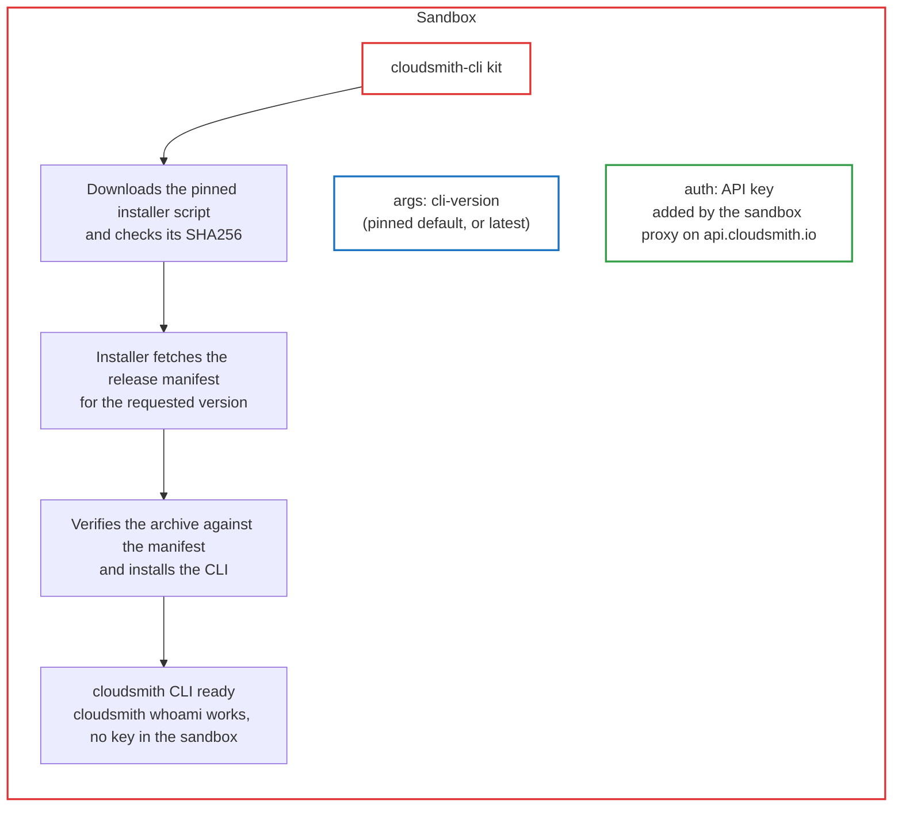

# cloudsmith-cli

Installs the [`cloudsmith` CLI](https://github.com/cloudsmith-io/cloudsmith-cli) and sends a Cloudsmith API key to `api.cloudsmith.io` through the sandbox proxy. Companion to [`cloudsmith-repo`](https://github.com/docker/sbx-kits-contrib/tree/main/cloudsmith-repo), which pulls packages and carries no API access. Compose this kit only when the agent needs the API (list, inspect, publish). Works with any base agent.

## Usage

Store the API key once (optional; without it the CLI installs and `cloudsmith whoami` reports no user):

```console
sbx secret set cloudsmith-api-key -t <api-key>
```

Create a sandbox, usually with the pull kit:

```console
sbx run claude --kit "docker.io/sbx/cloudsmith-repo-kit:latest" --kit "docker.io/sbx/cloudsmith-cli-kit:latest" --kit-arg cloudsmith-repo.path=/acme/prod .
```

Or from git or a local clone:

```console
sbx run claude --kit "git+https://github.com/docker/sbx-kits-contrib.git#dir=cloudsmith-cli" .
sbx run claude --kit ./cloudsmith-cli/ .
```

Inside the sandbox:

```console
cloudsmith --version
cloudsmith whoami
cloudsmith list packages ORG/REPO
```

## Arguments

`--kit-arg cloudsmith-cli.<name>=<value>`.

| Argument | Default | Value |
| --- | --- | --- |
| `cli-version` | `1.27.0` | A release number, or `latest` |

## How it works



- **Install.** The kit downloads Cloudsmith's [installer script](https://github.com/cloudsmith-io/cloudsmith-cli-install-script) (version and SHA256 pinned in the spec) to a file and checks the digest. The script fetches the release manifest for `cli-version` from the public `cloudsmith/cli` repository, verifies the archive against it, and installs under `/opt/cloudsmith-cli`. The kit symlinks `/usr/local/bin/cloudsmith`. Nothing is piped into `sh`, nothing comes from PyPI.
- **Auth.** The proxy adds `X-Api-Key: <key>` to every request to `api.cloudsmith.io`, from the CLI or any other process. Inside the sandbox `CLOUDSMITH_API_KEY` holds `proxy-managed`.
- **Authority.** Whatever the key may do (publish, delete, change policies), the sandbox may do. Bind a least-privilege service-account key. This is why the kit is separate: `cloudsmith-repo` alone has no API host and no API credential.
- **Bumping.** Installer: change `INSTALLER_VERSION` and `INSTALLER_SHA256` from its `SHA256SUMS`. CLI: change the `cli-version` default.

### Why these domains

| Domain | Why |
| --- | --- |
| `api.cloudsmith.io` | Cloudsmith API, key added as `X-Api-Key` |
| `dl.cloudsmith.io` | Installer script, release manifest and CLI archive from Cloudsmith's public repositories |

`dl.cloudsmith.io` is a literal so the install works when the pull kit uses a custom download domain. It is shared by every public Cloudsmith repository.

## Troubleshooting

| Symptom | Cause | Fix |
| --- | --- | --- |
| `cloudsmith whoami` shows no user | No key bound, or the key was rejected | `sbx secret set cloudsmith-api-key -t <api-key>`, recreate |
| CLI commands fail to connect | `api.cloudsmith.io` denied by a policy above the kit | `sbx policy log <sandbox>` |
| Install step exits 1 | Download or checksum failure, or `cli-version` does not exist | `sbx policy log <sandbox>`; check the version under `https://dl.cloudsmith.io/public/cloudsmith/cli/` |

## Cleanup

```console
sbx secret rm cloudsmith-api-key -f
```

`/opt/cloudsmith-cli` disappears with `sbx rm <sandbox>`.
