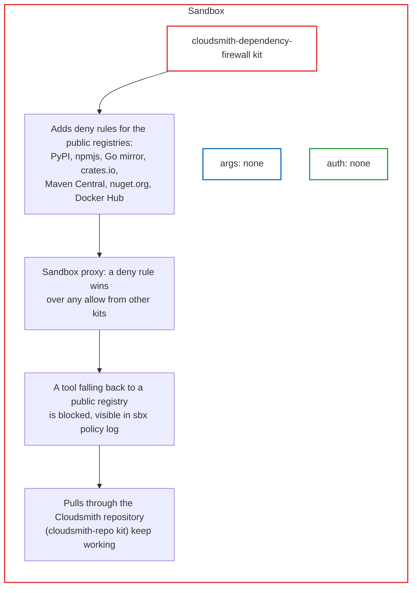

# cloudsmith-dependency-firewall

Denies the public package registries at the sandbox proxy: PyPI, npm, the Go mirror, crates.io, Maven Central, nuget.org and Docker Hub. Package clients cannot fall back to them and must use the repository that [`cloudsmith-repo`](https://github.com/docker/sbx-kits-contrib/tree/main/cloudsmith-repo) configured. No arguments, no credentials, no install steps.

## Usage

Compose it with `cloudsmith-repo`:

```console
sbx run claude --kit "docker.io/sbx/cloudsmith-repo-kit:latest" --kit "docker.io/sbx/cloudsmith-dependency-firewall-kit:latest" --kit-arg cloudsmith-repo.path=/acme/prod .
```

Or from git or a local clone:

```console
sbx run claude --kit "git+https://github.com/docker/sbx-kits-contrib.git#dir=cloudsmith-repo" --kit "git+https://github.com/docker/sbx-kits-contrib.git#dir=cloudsmith-dependency-firewall" --kit-arg cloudsmith-repo.path=/acme/prod .
sbx run claude --kit ./cloudsmith-repo/ --kit ./cloudsmith-dependency-firewall/ --kit-arg cloudsmith-repo.path=/acme/prod .
```

Inside the sandbox, a public registry is blocked and the same install works through Cloudsmith:

```console
curl -sS -o /dev/null -w '%{http_code}\n' https://pypi.org/simple/     # 403
pip download --no-deps -d /tmp <package-in-the-repo>                   # served by Cloudsmith
```

On the host, `sbx policy log <sandbox>` shows `pypi.org` as `denied: rule "kit:<sandbox>:deny"`.

## How it works



- **Deny wins.** `permissions.network.deny` beats any `allow` from the base agent or another kit, and lists only append across kits. A stale lockfile, a project `.npmrc` or a `--index-url` flag hits a policy block instead of a public registry.
- **Separate on purpose.** `cloudsmith-repo` alone is a redirect; the public registries stay reachable if the base agent allows them. This kit removes that network path. Adopt the redirect first, add enforcement with one extra `--kit`.
- **Agent note** (`kits-agent-context/cloudsmith-dependency-firewall.md`): report a package that cannot be installed (ecosystem, name, version, host, status) instead of changing registry settings or fetching from a URL.

### What it does not block

sbx policy is per hostname. The kit blocks the named endpoints, not "everything except one repository":

- Other public repositories on a shared Cloudsmith host such as `dl.cloudsmith.io`. Custom download domains narrow this to one organization.
- Anything the base agent or another kit allows: GitHub archives, `go get` with `GOPROXY=direct`, apt mirrors, ecosystems the pull kit does not configure (RubyGems, Conda, Composer, Hex).
- Warm local caches (`~/.npm`, `GOMODCACHE`, `~/.cargo/registry`).

Docker Hub is denied too, so `docker run alpine` inside the sandbox fails unless the image is mirrored in Cloudsmith, and kits whose startup pulls from Docker Hub (for example `qemu`) break.

To deny more hosts, add rules on the host with `sbx policy deny network <host>` (add `--sandbox <name>` to scope them) or fork the kit and extend `permissions.network.deny`.

### Why these domains

The kit allows nothing. It denies:

| Denied | Why |
| --- | --- |
| `pypi.org`, `files.pythonhosted.org` | PyPI index and file host |
| `registry.npmjs.org`, `registry.npmjs.com`, `registry.yarnpkg.com` | npm registry, the `.com` alias Cloudsmith redirects unknown packages to, Yarn classic's default |
| `proxy.golang.org` | Go module mirror |
| `index.crates.io`, `static.crates.io`, `crates.io` | crates.io index, downloads, legacy site |
| `repo1.maven.org`, `repo.maven.apache.org` | Maven Central |
| `api.nuget.org`, `www.nuget.org`, `globalcdn.nuget.org`, `azuresearch-usnc.nuget.org`, `azuresearch-ussc.nuget.org` | nuget.org v3 feed, legacy v2 feed, download CDN, search hosts |
| `registry-1.docker.io`, `auth.docker.io`, `production.cloudflare.docker.com`, `index.docker.io` | Docker Hub registry, token endpoint, blob CDN, legacy index |

## Cleanup

Nothing on the host. The deny rules disappear with `sbx rm <sandbox>`. Rules added with `sbx policy deny network` are removed with `sbx policy rm`.
